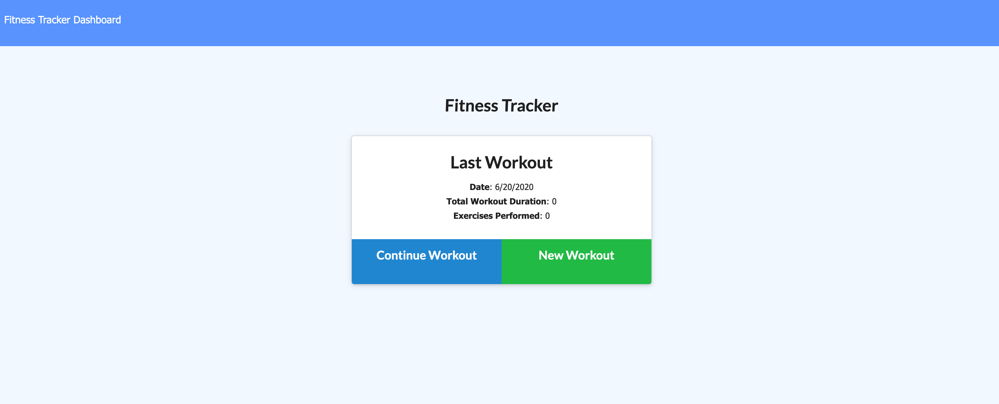
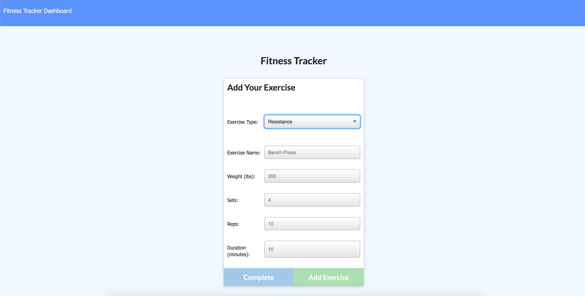
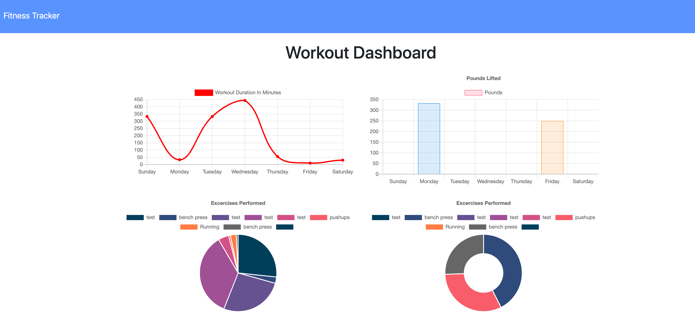

  # Fitness Tracker
  
  
  

  ## Description
  The fitness tracker allows users to create, track and manage workouts/exercises using Chart.js.
  
  
  ## Installation
  [Deployed URL](https://immense-hamlet-49173.herokuapp.com/?id=5f2776cd0e62ce0024b22d1a) 
  
  
  

  ## Technologies
  

             
  